<!-- Improved compatibility of back to top link: See: https://github.com/othneildrew/Best-README-Template/pull/73 -->
<a name="readme-top"></a>
<!--
*** Thanks for checking out the Best-README-Template. If you have a suggestion
*** that would make this better, please fork the repo and create a pull request
*** or simply open an issue with the tag "enhancement".
*** Don't forget to give the project a star!
*** Thanks again! Now go create something AMAZING! :D
-->


<!-- PROJECT SHIELDS -->
<!--
*** I'm using markdown "reference style" links for readability.
*** Reference links are enclosed in brackets [ ] instead of parentheses ( ).
*** See the bottom of this document for the declaration of the reference variables
*** for contributors-url, forks-url, etc. This is an optional, concise syntax you may use.
*** https://www.markdownguide.org/basic-syntax/#reference-style-links
-->

<!-- PROJECT LOGO -->
<br />
<div align="center">
  <a>
    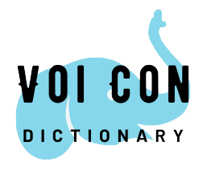
  </a>

  <h3 align="center">VoiCon Dictionary</h3>

  <p align="center">
    Developed by Team <i>Con Voi</i> from HCMUS: </br>
    Dang Trung Nghia
    </br>
    Tran Tuan Viet
    </br>
    Tran Le Quoc
    </br>
    Bui Nguyen Hoang
    </br>
  </p>
</div>


<!-- TABLE OF CONTENTS -->
<details>
  <summary>Table of Contents</summary>
  <ol>
    <li>
      <a href="#about-the-project">About The Project</a>
    </li>
    <li><a href="#usage">Usage</a></li>
    <li><a href="#data-structure">Data structure</a></li>
    <li><a href="#contact">Contact</a></li>
  </ol>
</details>


<!-- ABOUT THE PROJECT -->
## About The Project
<div align="center">
    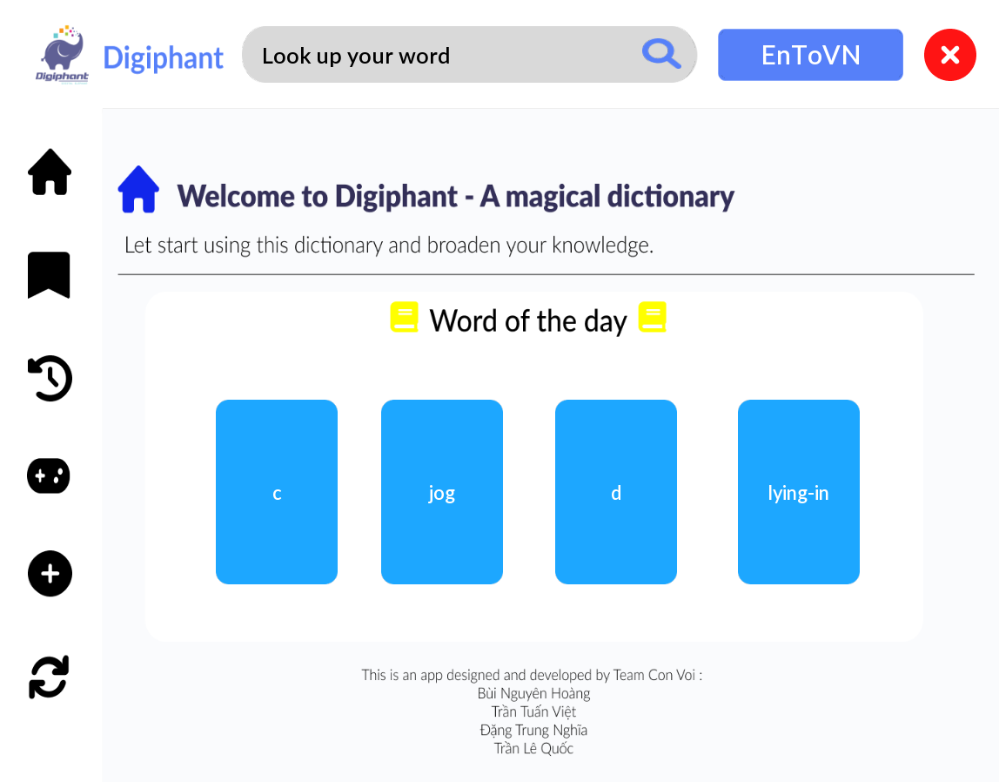
</div>

A dictionary is a popular application to help users look up the meanings of words. In dictionary app, there are some several basics tasks such as searching a word, adding a new word, updating a word, $\dots$ . With a developer, in small data sets, there are many ways to solve the basic tasks above, for example using vector or array to save all words and search them. However, in a big data sets, it might compose lots of memories to save all word and lots of time to search our keyword. A common way to solve this problem is to use Trie data structure to save the list of words in a tree with memory: **256 childrens for a node** which is better than using vector. But it still contains too much spaces to save the tree. To address this problems, our team will use a data structure to save all words in a tree with **only 3 childrens for a node: Tenary Search Tree.**

<p align="right">(<a href="#readme-top">back to top</a>)</p>

<!-- USAGE EXAMPLES -->
## Usage

### Menu

<div align="center">
    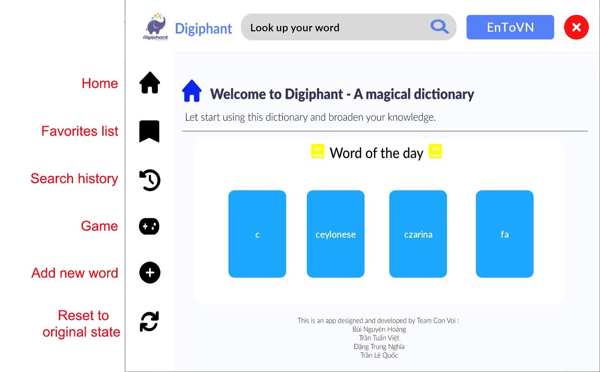
</div>

- **Home**: home Screen
- **Favorites list**: list of words that have been added to the favorites list
- **Search history**: show search history
- **Game**: play games with the dictionary
- **Add new word**: add a new word to dataset
- **Reset to original state**: reset dataset to original state

### Home

<div align="center">
    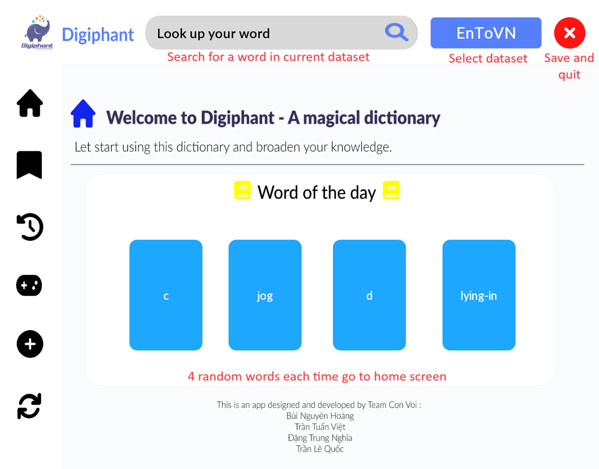
</div>

The suggestion when searching for a word can be processed effectively using Ternary Search Tree:

<div align="center">
    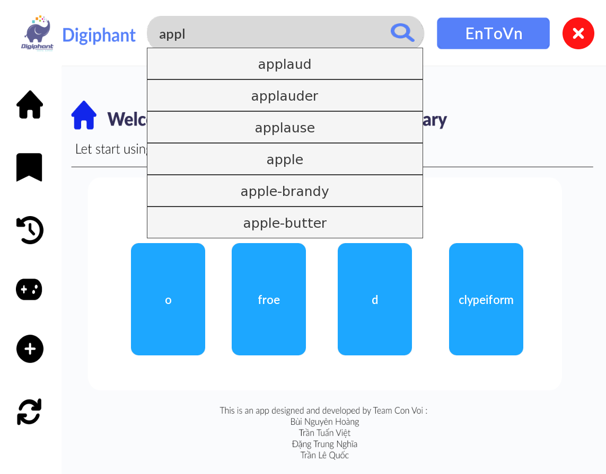
</div>

Can edit the definition of a word, add word to favorites list, or remove word from the dataset:

<div align="center">
    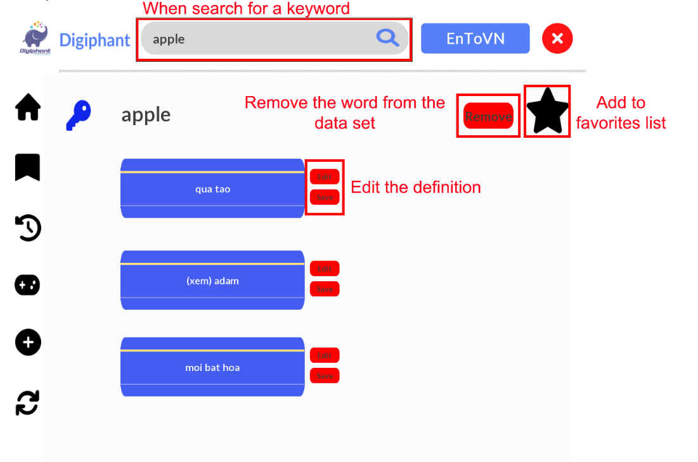
</div>

<p align="right">(<a href="#readme-top">back to top</a>)</p>

### Favorites list

<div align="center">
    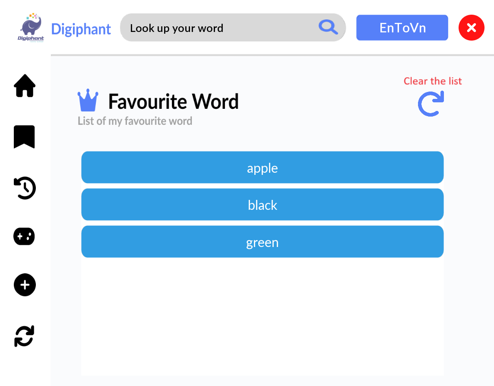
</div>

<p align="right">(<a href="#readme-top">back to top</a>)</p>

### Search history

<div align="center">
    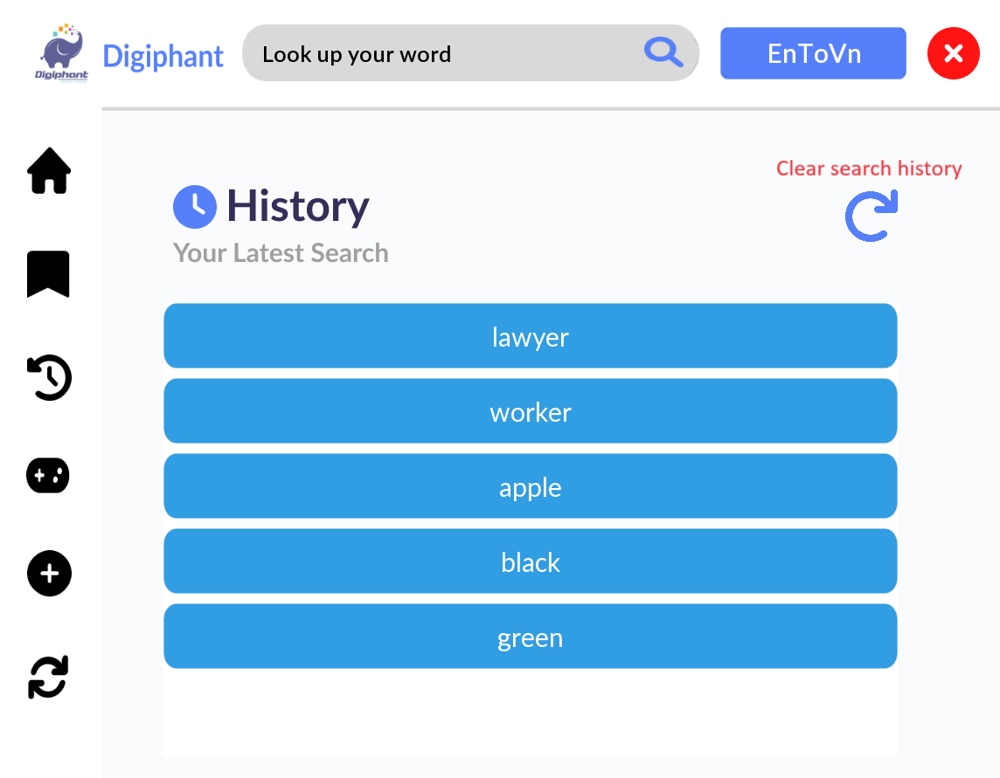
</div>

<p align="right">(<a href="#readme-top">back to top</a>)</p>

### Game

There are 2 game modes:

- **Game mode 1**: given a word and choose its correct definition
- **Game mode 2**: given a definition and choose its corresponding word

<div align="center">
    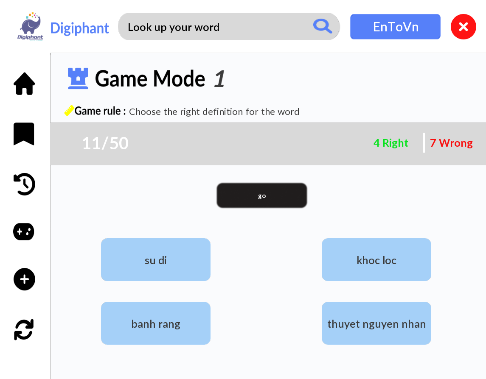
</div>

<p align="right">(<a href="#readme-top">back to top</a>)</p>

### Add new word

Add a new word with 3 definitions: 

<div align="center">
    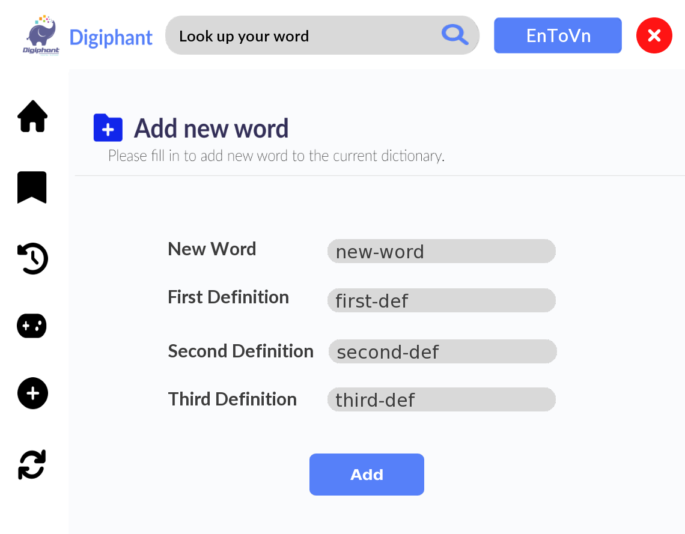
</div>

<p align="right">(<a href="#readme-top">back to top</a>)</p>

### Reset dataset

Can reset the dataset to its original state (when open the dictionary) if don't want to save the changes.

<div align="center">
    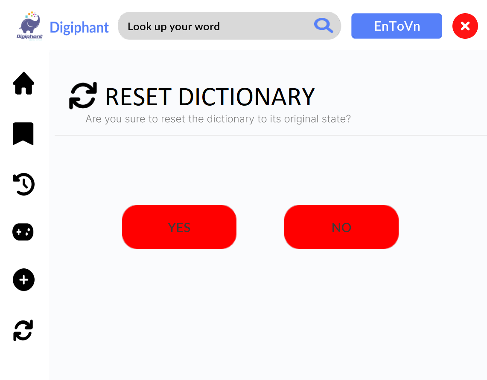
</div>

<p align="right">(<a href="#readme-top">back to top</a>)</p>

## Data structure

Ternary Search Tree is a special Trie data structure where the child nodes of a standard trie are ordered as a binary search tree.

Unlike Trie (standard) where each node may contains 256 pointers (all characters in ASCII table) for its children, each node in a ternary search tree contains only 3 pointers:

- The left pointer points to the node whose value is less than the value in the current node.
- The equal (middle) pointer points to the node whose value is equal to the value in the current node.
- The right pointer points to the node whose value is greater than the value in the current node.

The equal pointer is the pointer that points to the next character in the word.

Each node has a field to store a character and another field to mark the end of word.

Each node is designed as this:

```C++
struct Node {
    char data; // the character in a node
    int EOS = 1; // is end of string or not
    Node* left, * middle, * right; // 3 children of a node
    vector <string> listDef; // list of definitions if this node is end of a keyword
}
```

<div align="center">
    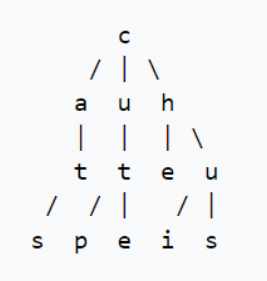
</div>

For instance, the image above show the visualization of a tenary search tree with string: "cute","cup","at","as","he","us" and "i".

The advantage of using Tenary Search Tree is more space efficient (only 3 pointers per nodes compare to 256 in Trie).

The following is an analysis of 5 basic functions used in the application:

<div align="center">
    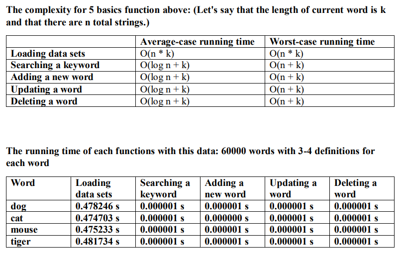
</div>

<p align="right">(<a href="#readme-top">back to top</a>)</p>


<!-- CONTACT -->
## Contact

Dang Trung Nghia - dtnghia.forwork@gmail.com

Tran Tuan Viet - ttviet2805@gmail.com

<p align="right">(<a href="#readme-top">back to top</a>)</p>

<!-- MARKDOWN LINKS & IMAGES -->
<!-- https://www.markdownguide.org/basic-syntax/#reference-style-links -->
[contributors-shield]: https://img.shields.io/github/contributors/othneildrew/Best-README-Template.svg?style=for-the-badge
[contributors-url]: https://github.com/othneildrew/Best-README-Template/graphs/contributors
[forks-shield]: https://img.shields.io/github/forks/othneildrew/Best-README-Template.svg?style=for-the-badge
[forks-url]: https://github.com/othneildrew/Best-README-Template/network/members
[stars-shield]: https://img.shields.io/github/stars/othneildrew/Best-README-Template.svg?style=for-the-badge
[stars-url]: https://github.com/othneildrew/Best-README-Template/stargazers
[issues-shield]: https://img.shields.io/github/issues/othneildrew/Best-README-Template.svg?style=for-the-badge
[issues-url]: https://github.com/othneildrew/Best-README-Template/issues
[license-shield]: https://img.shields.io/github/license/othneildrew/Best-README-Template.svg?style=for-the-badge
[license-url]: https://github.com/othneildrew/Best-README-Template/blob/master/LICENSE.txt
[linkedin-shield]: https://img.shields.io/badge/-LinkedIn-black.svg?style=for-the-badge&logo=linkedin&colorB=555
[linkedin-url]: https://linkedin.com/in/othneildrew
[product-screenshot]: images/screenshot.png
[Next.js]: https://img.shields.io/badge/next.js-000000?style=for-the-badge&logo=nextdotjs&logoColor=white
[Next-url]: https://nextjs.org/
[React.js]: https://img.shields.io/badge/React-20232A?style=for-the-badge&logo=react&logoColor=61DAFB
[React-url]: https://reactjs.org/
[Vue.js]: https://img.shields.io/badge/Vue.js-35495E?style=for-the-badge&logo=vuedotjs&logoColor=4FC08D
[Vue-url]: https://vuejs.org/
[Angular.io]: https://img.shields.io/badge/Angular-DD0031?style=for-the-badge&logo=angular&logoColor=white
[Angular-url]: https://angular.io/
[Svelte.dev]: https://img.shields.io/badge/Svelte-4A4A55?style=for-the-badge&logo=svelte&logoColor=FF3E00
[Svelte-url]: https://svelte.dev/
[Laravel.com]: https://img.shields.io/badge/Laravel-FF2D20?style=for-the-badge&logo=laravel&logoColor=white
[Laravel-url]: https://laravel.com
[Bootstrap.com]: https://img.shields.io/badge/Bootstrap-563D7C?style=for-the-badge&logo=bootstrap&logoColor=white
[Bootstrap-url]: https://getbootstrap.com
[JQuery.com]: https://img.shields.io/badge/jQuery-0769AD?style=for-the-badge&logo=jquery&logoColor=white
[JQuery-url]: https://jquery.com 
